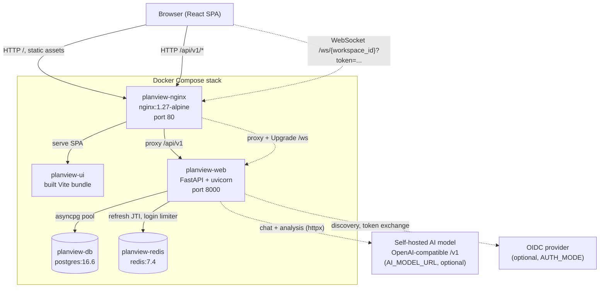
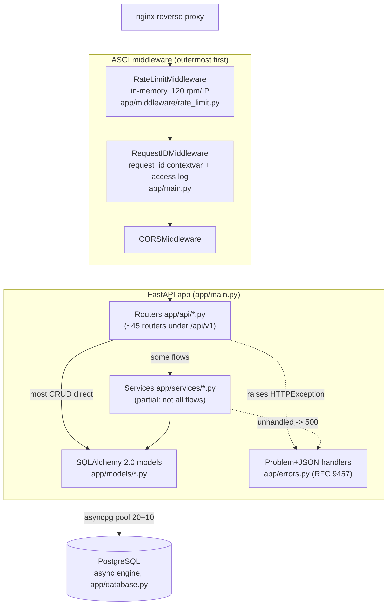
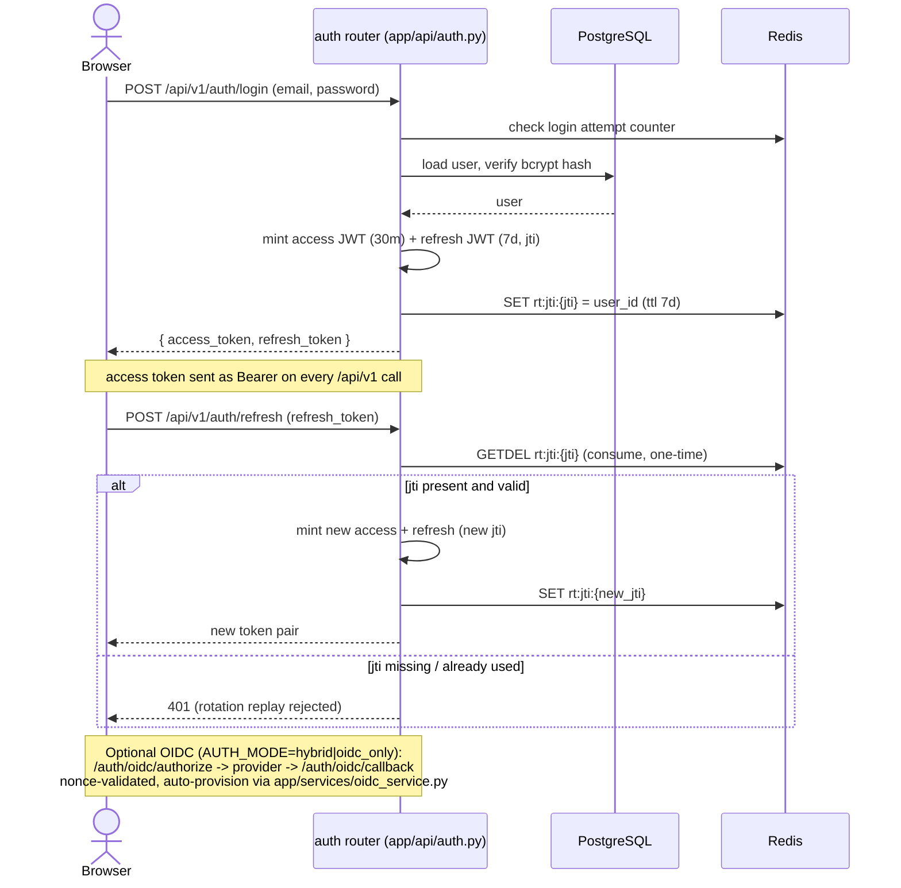
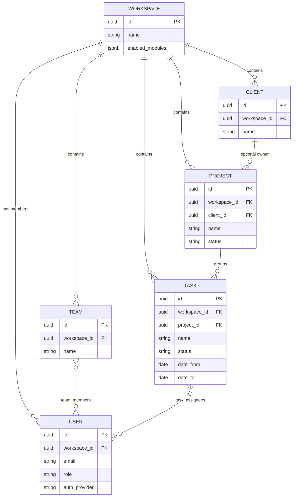
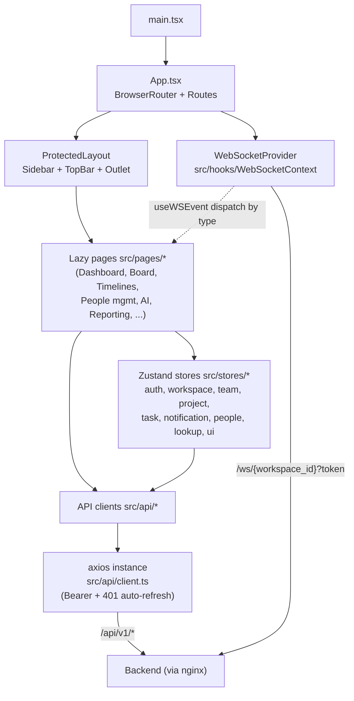

# Planview Architecture

This document describes the architecture of Planview **as it is built today**, not as
it is aspired to be. Where the running code diverges from the design intent (for
example the `CLAUDE.md` claim that realtime runs over Redis pub/sub), the divergence is
called out explicitly. Diagrams are Mermaid and render on GitHub.

Architectural deviations referenced below should be captured as ADRs under `docs/adr/`.
That directory does not exist yet: create it when the first ADR is written.

---

## 1. System Overview

Planview ships as five containers orchestrated by Docker Compose (see
`docker-compose.yml`). The browser only ever talks to nginx, which fronts the static UI
bundle and reverse-proxies the API and the WebSocket. The backend talks to PostgreSQL
and Redis, and optionally to a self-hosted, OpenAI-compatible AI model for the analysis
and chat features.



nginx serves the compiled SPA from the `planview-ui` image, proxies `/api/v1/*` to the
backend, and upgrades `/ws/*` to a WebSocket. The backend (`planview-web`) runs Alembic
migrations on start (`alembic upgrade head`) then launches uvicorn. PostgreSQL is the
single source of truth; Redis is password-protected and used for refresh-token rotation
state and login attempt counting. The AI model and OIDC provider are both optional and
configured purely by environment variable.

---

## 2. Backend Layering

Requests enter through nginx, pass two custom middlewares, hit a FastAPI router under
`app/api/`, and from there reach the database. There is a `services/` package, but it is
**partial**: only some flows (analysis report generation, imports/exports, OIDC, AI,
webhooks, recurrence, email, notifications) are factored into services. The majority of
CRUD endpoints query SQLAlchemy models directly inside the route handler. There is **no
repository layer**, and no consistent service boundary. This is the single largest
structural deviation from the project rules in `CLAUDE.md` and should be recorded as an
ADR under `docs/adr/`.



Middleware order is set in `app/main.py`: `RateLimitMiddleware` is added last so it runs
outermost, then `RequestIDMiddleware`, then CORS. The rate limiter is **in-memory per
process** (`collections.defaultdict`), not Redis-backed, so it does not coordinate across
workers. `RequestIDMiddleware` mints or echoes an `X-Request-ID`, binds it to the
`request_id_var` contextvar (`app/logging_config.py`) so it survives `await`, and logs a
structured `request_completed` event via structlog JSON. All errors are converted to
`application/problem+json` (RFC 9457) by handlers registered in `app/errors.py`; the
catch-all never leaks a traceback and every body carries the `request_id` in `instance`.
Database access is async throughout via the engine in `app/database.py`
(`pool_size=20, max_overflow=10, pool_pre_ping, pool_recycle=3600`).

---

## 3. Realtime Flow

Realtime updates are broadcast **in process**, not over Redis pub/sub. `emit_event`
(`app/websocket/events.py`) calls `manager.broadcast` directly, and the
`ConnectionManager` (`app/websocket/manager.py`) holds the live WebSockets in an
in-memory `dict[workspace_id, list[WebSocket]]`. This works correctly only while the
backend runs as a **single uvicorn process**: a second worker would have its own
connection table and miss the broadcast. The `CLAUDE.md` description of "WebSocket via
Redis pub/sub" is therefore aspirational, not current. Moving the fan-out onto a Redis
pub/sub channel is the prerequisite for horizontal scaling and should be an ADR under
`docs/adr/`.

```mermaid
sequenceDiagram
    actor User as User A (browser)
    participant Nginx as nginx
    participant API as FastAPI route (app/api/tasks.py)
    participant DB as PostgreSQL
    participant Mgr as ConnectionManager (in-process)
    actor Other as User B, C in same workspace

    User->>Nginx: PATCH /api/v1/.../tasks/{id}
    Nginx->>API: proxy request
    API->>DB: UPDATE task (async session)
    DB-->>API: committed
    API->>Mgr: emit_event(workspace_id, "task.updated", data)
    Mgr->>Mgr: look up active_connections[workspace_id]
    Mgr-->>Other: send_text({type, data}) to each socket
    API-->>User: 200 problem-free JSON

    Note over User,Other: Clients opened /ws/{workspace_id}?token=...<br/>JWT validated before accept (app/main.py).<br/>60s idle -> server ping; client sends "ping" -> "pong".
```

A client connects to `/ws/{workspace_id}` with the access token as a query parameter.
`app/main.py` decodes and validates the JWT (must be an `access` token with a `sub`)
**before** accepting the socket, closing with code 4001 otherwise. After a successful
mutation, the route calls `emit_event`, which serialises `{type, data}` and pushes it to
every socket registered for that workspace, pruning any that error. The frontend
`WebSocketProvider` dispatches these by `type` to `useWSEvent` subscribers (for example
the `notification.new` handler in `App.tsx`).

---

## 4. Auth Flow

Password login issues a short-lived access JWT (30 min) and a refresh JWT (7 days), both
signed HS256. The backend refuses to start if `JWT_SECRET_KEY` is left at the insecure
default (`app/config.py`). Refresh tokens carry a `jti` claim whose value is stored in
Redis; refreshing consumes the stored `jti` and issues a new pair (one-time-use
rotation), so a replayed refresh token fails. Redis also backs login attempt limiting.
OIDC is optional and selected by `AUTH_MODE` (`password`, `hybrid`, `oidc_only`).



The frontend axios client (`src/api/client.ts`) attaches the access token from
`localStorage` on every request and, on a `401`, transparently calls `/auth/refresh`
once, stores the rotated pair, and retries the original request; if refresh fails it
clears tokens and redirects to `/login`. Logout revokes the stored `jti` so the refresh
token cannot be reused.

---

## 5. Data Model (high level)

Planview has roughly 45 tables across 20 Alembic migrations. The diagram below shows only
the **core planning entities**. The bulk of the schema (1:1 meetings, objectives,
compliance, competencies, leave, recruitment, development plans, reviews, wellbeing,
onboarding, early-talent, lookups, time entries, AI chat, analysis reports, and more)
hangs off `workspaces` and `users` and is deliberately omitted here for readability.



Every table uses a UUID primary key (`UUIDPrimaryKey` mixin) defaulted by
`gen_random_uuid()` and timestamps from `TimestampMixin` (`app/models/base.py`).
`Workspace` is the tenancy root: users, teams, projects, tasks and clients all cascade
from it. Team membership and task assignment are many-to-many association tables
(`team_members`, `task_assignees`). `enabled_modules` on `workspaces` is the JSONB flag
map that drives which feature modules (and therefore sidebar links and routers) are live
for a workspace.

---

## 6. Frontend Structure

The React 19 + TypeScript SPA (Vite 6, Tailwind v4) routes through `src/App.tsx`. Every
page is `React.lazy`-loaded behind `Suspense`, so each route is a separate chunk. Pages
read and mutate state through Zustand stores and a shared axios client
(`src/api/client.ts`). There is currently **no TanStack Query**: server state is fetched
imperatively in `useEffect` and cached in Zustand stores. Migrating server-state caching
from hand-rolled Zustand to TanStack Query is a planned change and should be recorded as
an ADR under `docs/adr/`.



`App.tsx` splits routes into public (`/login`, `/auth/oidc/callback`, `/shared/:token`)
and a protected tree wrapped by `WebSocketProvider` and `ProtectedLayout`. On mount the
layout hydrates auth, workspaces, teams and projects via their stores, then renders the
matched lazy page into the `Outlet`. Every API call flows through the single axios
instance in `src/api/client.ts`, which injects the Bearer token and handles 401-driven
refresh-and-retry. Realtime events arrive on a separate WebSocket managed by
`WebSocketProvider` and are consumed by pages via the `useWSEvent` hook.
